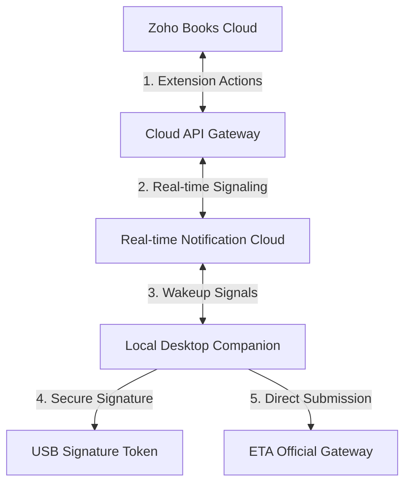

# ⚡ Zoho Books — Egyptian Tax Authority (ETA) e-Invoicing & e-Receipt Integration Suite

An enterprise-grade, high-performance **B2B SaaS integration suite** designed to bridge **Zoho Books** accounting workflows with the official **Egyptian Tax Authority (ETA) eInvoicing & e-Receipt V1.0 Portal**. 

This integration leverages a secure hybrid architecture that combines cloud serverless power with a local desktop cryptographic bridge.

---

## 🌟 Core Integration Features

### 🔌 1. Native Zoho Books ERP Extension
* **Direct Billing Interface**: Submit documents to the ETA directly from the Zoho Books Invoice/Credit Note/Debit Note detail view.
* **Smart Code Mapping**: Custom fields mapping standard Zoho Books items to official **EGS** (Egyptian Group System) and **GS1** codes.
* **Org-Wide Settings**: Configure tax codes, activity codes, branch configurations, and API credentials directly inside your Zoho Books organization.
* **Interactive UI Signals**: Instant toast notifications and validation banners inside Zoho Books showing document acceptance or warning codes.

### 🖥️ 2. Desktop Companion App (Local Daemon)
* **Hardware Security Modules (HSM)**: Connects directly with local USB tokens and smart cards for detached cryptographic signatures.
* **Embedded Local API Bridge**: A secure background local service that bridges browser-based Zoho Books actions with physical USB tokens.
* **Silent System Tray Companion**: Autoruns silently in the system tray at user login with minimal system resource usage.
* **Automatic Silent Installer**: Installer package with system tray autorun configurations for easy organization-wide deployment.

### ☁️ 3. Resilient Cloud Gateway
* **ETA Payload Canonicalization**: Automatically canonicalizes invoices into the official ETA-mandated format.
* **Bypass Cloud IP Constraints**: Coordinates local submission routes to bypass cloud-IP blocking restrictions, ensuring direct client-to-ETA connections.
* **Rate-Limit Resilience**: Distributed queues and worker engines manage PDF printouts and bulk submissions to respect ETA’s strict API throttling limits.
* **Schema Validation & Logging**: Advanced payload validation with secure database logging for auditability and compliance.

### 🔀 4. Real-time Synchronization
* **Out-of-Band Workflows**: Handshakes and signals sent in real time to the local companion app for background submissions, rejections, or document cancellations.
* **No Manual Page Refresh**: Instant visual updates on invoice submission statuses.

### 💳 5. SaaS Billing & Subscriptions
* **Tier-Based SaaS Management**: Supports multiple licensing structures (starter, business, enterprise) with built-in subscription checkers and usage billing.

---

## 🛡️ Security & Compliance
* **Tenant Separation**: Strict multi-tenant data separation in the cloud database.
* **Zero Secret Sharing**: Private encryption keys and PINs are processed purely on the local machine and never transit through the cloud control plane.
* **Official Compliance**: Fully matches the Egyptian Tax Authority signature specifications and document templates.

---

## 🗺️ Architecture Overview

> [!NOTE]
> For implementation details, developer documentation, or custom enterprise deployments, please contact the development team at Wanas Apps.
