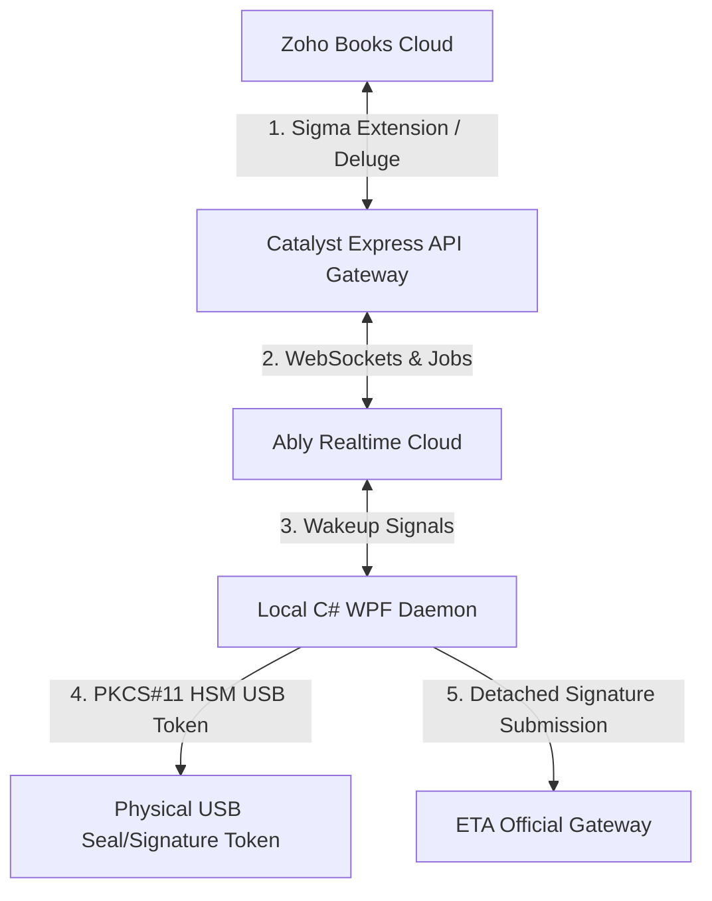

# ⚡ Zoho Books — Egyptian Tax Authority (ETA) e-Invoicing & e-Receipt Integration Suite

An enterprise-grade, high-performance **B2B SaaS integration suite** designed to bridge **Zoho Books** accounting workflows with the official **Egyptian Tax Authority (ETA) eInvoicing & e-Receipt V1.0 Portal**. 

This integration leverages a secure hybrid architecture that combines cloud serverless power with local desktop cryptographic hardware.

---

## 🌟 Core Integration Features

### 🔌 1. Native Zoho Books ERP Extension (Sigma)
* **Direct Billing Interface**: Submit documents to the ETA directly from the Zoho Books Invoice/Credit Note/Debit Note detail view.
* **Smart Code Mapping**: Custom fields mapping standard Zoho Books items to official **EGS** (Egyptian Group System) and **GS1** codes.
* **Org-Wide Settings**: Configure tax codes, activity codes, branch configurations, and API credentials directly inside your Zoho Books organization.
* **Interactive UI Signals**: Instant Deluge-driven toast notifications and validation banners inside Zoho Books showing document acceptance or warning codes.

### 🖥️ 2. Desktop companion App (WPF Local Daemon)
* **PKCS#11 Hardware Security Modules (HSM)**: Connects directly with local USB tokens (e.g., Egypt Trust, Misr El-Makasa) for detached **CAdES-BES** cryptographic signatures.
* **Embedded Minimal API Bridge**: A secure headless localhost background server (listening on port `9090`) that bridges browser-based Zoho Books actions with local physical USB tokens.
* **Silent System Tray Companion**: Autoruns silently in the system tray at user login with minimal RAM footprint.
* **Automatic Silent Installer**: Dual-privilege MSI installer compiled via Inno Setup for hassle-free organization-wide deployment.

### ☁️ 3. Resilient Cloud Gateway (Zoho Catalyst)
* **ETA Payload Canonicalization**: Automatically canonicalizes invoices into the official ETA-mandated JSON structure.
* **Bypass Cloud IP/Firewall Constraints**: Coordinates local C# submission routes to bypass cloud-IP blocking restrictions, ensuring direct client-to-ETA connections.
* **Rate-Limit Resilience**: Distributed cron queues and worker engines manage PDF printouts and bulk submissions to respect ETA’s strict API throttling limits.
* **Schema Validation & Logging**: Zod-based validation of payloads on the Express cloud plane, with secure datastore logging for auditing.

### 🔀 4. Real-time Synchronization (Ably WebSockets)
* **Out-of-Band Workflows**: Handshakes and signals sent in real time to the local companion app for background submissions, rejections, or document cancellations.
* **No Manual Page Refresh**: Instant visual updates on invoice submission statuses.

### 💳 5. SaaS Billing & Subscriptions (Stripe)
* **Tier-Based SaaS Management**: Supports multiple licensing structures (starter, business, enterprise) with built-in subscription checkers and usage billing.

---

## 🛡️ Security & Compliance
* **GDPR & HIPAA Compliant**: Multi-tenant database separation on Zoho Catalyst.
* **Zero Secret Sharing**: Private encryption keys and PKCS#11 PINs are processed purely on the local Windows machine and never transit through the cloud control plane.
* **Official Compliance**: Fully matches the Egyptian Tax Authority V1.0 signature specifications and document templates.

---

## 🗺️ Architecture Overview

> [!NOTE]
> For implementation details, developer documentation, or custom enterprise deployments, please contact the development team at Wanas Apps.
